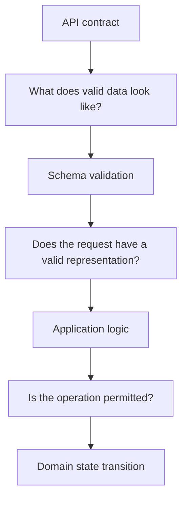
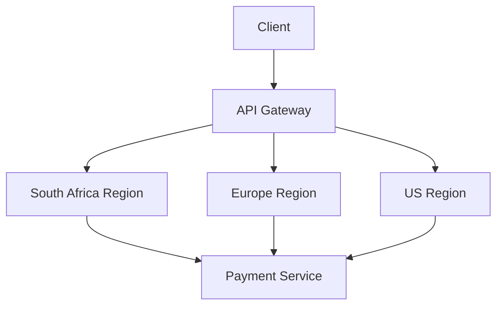
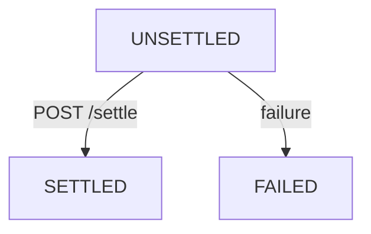
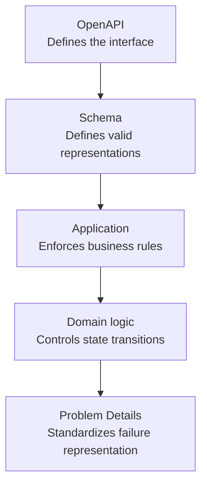
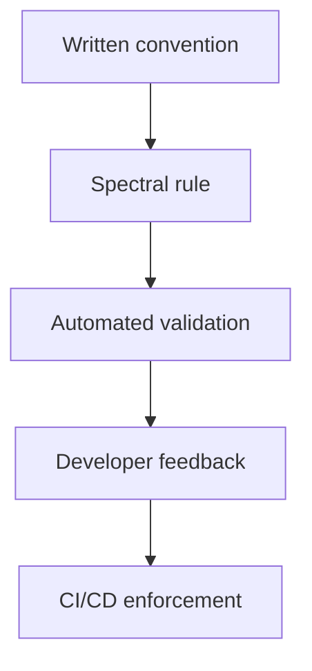
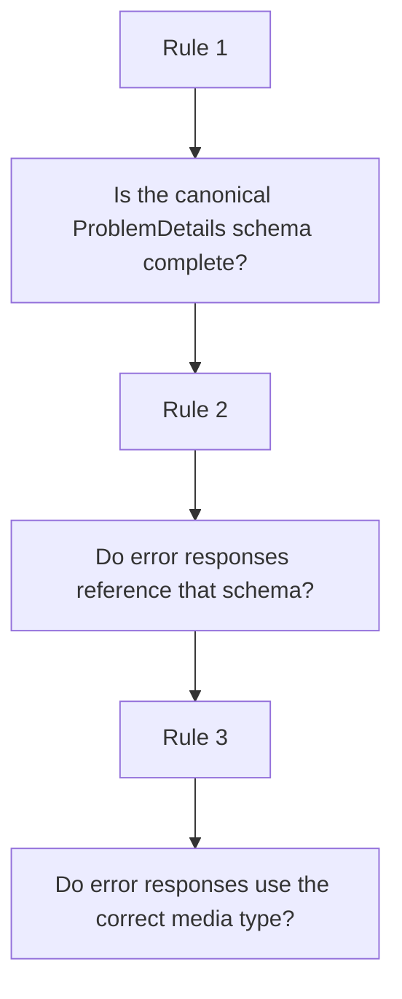
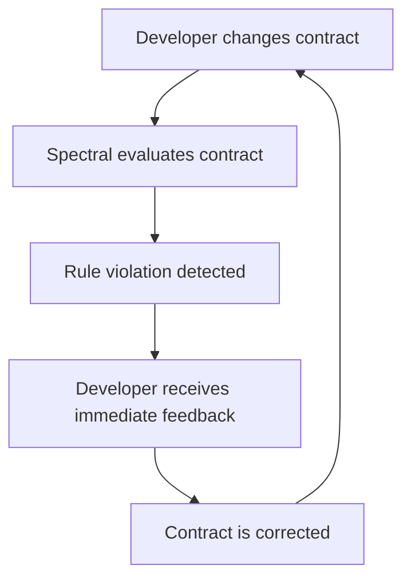
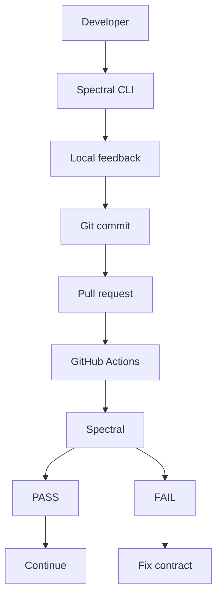
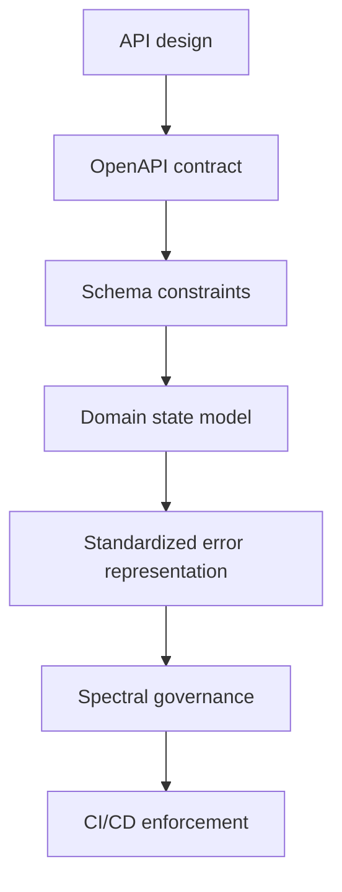

# Contract-First Architecture: Governing Microservice Boundaries with OpenAPI 3.2 and Spectral

## Introduction

In a distributed system, an API contract is more than documentation.

It defines the boundary between services and tells consumers what data they can send, what data they can receive, and which representations are considered valid.

When an implementation and its contract drift apart, consumers begin to depend on behavior that may no longer be guaranteed. Frontends, mobile applications, and downstream services can end up reverse-engineering behavior from implementation details instead of relying on an explicit contract.

This is one reason contract-first API design is useful.

In a contract-first approach, the API specification is designed before the implementation. The specification becomes a shared scope that developers, consumers, reviewers, and tooling can reuse.

This article explores how OpenAPI 3.2 can be used to model strict API contracts, represent state-dependent resources, standardize error responses with RFC 9457 Problem Details, and enforce API conventions with Spectral and GitHub Actions.

The aim is not to use every feature OpenAPI provides. But to make repeatable rules enforceable.

## What this article covers

- Strict schema modeling with OpenAPI 3.2
- Modeling state-dependent resources with "oneOf" and "allOf"
- The role of "discriminator" in polymorphic schemas
- The relationship between OpenAPI 3.2 and JSON Schema Draft 2020-12
- Standardizing API errors with RFC 9457
- Modeling a payment lifecycle as an API contract
- Turning API conventions into Spectral rules
- Running those rules locally and in CI/CD

## Prerequisites

You should have a basic understanding of:

- HTTP methods and status codes
- REST APIs
- YAML
- JSON Schema
- OpenAPI
- Git and GitHub Actions

The examples use OpenAPI 3.2.1.


## 1. Contract-First Architecture

There are two common approaches to designing APIs: code-first and contract-first.

In a code-first design, developers begin with implementation and generate or derive the API specification from the resulting code.

In a contract-first approach, the API interface is defined before implementation.

Neither approach eliminates the need for business logic. The difference is where the API boundary is established.

Consider a service that exposes a withdrawal operation:

```bash
POST /accounts/005/withdraw
```

A code-first implementation might define the request structure inside the application and expose the resulting endpoint.

A contract-first design starts by describing the request:

```yaml
schema:
  type: object
  properties:
    amount:
      type: integer
      minimum: 100
    currency:
      type: string
      enum:
        - ZAR
        - USD
        - EUR
  required:
    - amount
    - currency
```

The contract now establishes several rules:

- "amount" must be an integer.
- "amount" must be at least "100".
- "currency" must be one of the permitted values.
- Both fields are required.

The API boundary therefore rejects representations that violate these constraints before they reach the deeper application logic.

This distinction matters.

A schema can deny a misrepresented data. It cannot, by itself, determine whether a business operation or logic is permitted.

For example, a schema can establish that a withdrawal contains a valid amount. The application must still determine whether the account has sufficient funds, whether the account is active, and whether the withdrawal is permitted at the point of request.

This gives us a useful separation:



The contract establishes the scope.

The application establishes the behavior.


## 2. Strict Schema Modeling

Strict schema modeling helps make the set of valid API representations explicit.

Consider an account resource:

```json
{
  "accountStatus": "active",
  "balance": 50000,
  "currency": "ZAR"
}
```

This representation contains state that may influence what operations the client can perform.

If an API accepts a poorly defined scope:

```yaml
schema:
  type: object
```

the contract says very little about what makes up a valid instance.

A stricter schema can define the expected structure:

```yaml
type: object
properties:
  accountStatus:
    type: string
    enum:
      - active
      - suspended
      - closed

  balance:
    type: integer
    minimum: 0

  currency:
    type: string
    enum:
      - ZAR
      - USD
      - EUR

required:
  - accountStatus
  - balance
  - currency
```

Now the API contract describes a much smaller set of valid representations.

This is useful because downstream consumers no longer have to infer the shape of the resource from implementation behavior.

The important principle is:

> A strict schema should express meaningful domain constraints, not merely add keywords for the sake of strictness.


## 3. Modeling State With Polymorphism

Some resources do not have the same representation in every state.

An account can be:

```yaml
Account
├── Pending
├── Verified
└── Suspended
```

Each state may have different required properties.

For instance:

- A pending account may require a name.
- A verified account may also require "verifiedAt".
- A suspended account may addtionally require "suspendedAt".

OpenAPI supports composition through JSON Schema keywords such as "oneOf" and "allOf".

A simplified model looks like this:

```yaml
components:
  schemas:

    AccountBase:
      type: object
      required:
        - status
      properties:
        status:
          type: string
          enum:
            - PENDING
            - VERIFIED
            - SUSPENDED

    Account:
      oneOf:
        - $ref: '#/components/schemas/Pending'
        - $ref: '#/components/schemas/Verified'
        - $ref: '#/components/schemas/Suspended'

      discriminator:
        propertyName: status
        mapping:
          PENDING: '#/components/schemas/Pending'
          VERIFIED: '#/components/schemas/Verified'
          SUSPENDED: '#/components/schemas/Suspended'

    Pending:
      allOf:
        - $ref: '#/components/schemas/AccountBase'
        - type: object
          properties:
            name:
              type: string
          required:
            - name

    Verified:
      allOf:
        - $ref: '#/components/schemas/AccountBase'
        - type: object
          properties:
            name:
              type: string
            verifiedAt:
              type: string
              format: date-time
          required:
            - name
            - verifiedAt

    Suspended:
      allOf:
        - $ref: '#/components/schemas/AccountBase'
        - type: object
          properties:
            name:
              type: string
            suspendedAt:
              type: string
              format: date-time
          required:
            - name
            - suspendedAt
```

The model separates common properties from state-specific properties.

- "AccountBase" contains information common to all states.

- "Pending", "Verified", and "Suspended" extend that base representation with state-specific requirements.

- "oneOf" then defines the possible representations of "Account".

**What "oneOf" does:**

"oneOf" requires the instance to validate against exactly one of the listed schemas.

That makes it useful when the states represent a different format.

For example:

```yaml
Account:
  oneOf:
    - $ref: '#/components/schemas/Pending'
    - $ref: '#/components/schemas/Verified'
    - $ref: '#/components/schemas/Suspended'
```

A payload should therefore match one and only one of those alternatives.

**What "allOf" does:**

"allOf" combines schemas.

This example:

```yaml
Verified:
  allOf:
    - $ref: '#/components/schemas/AccountBase'
    - type: object
      ...
```

means that a verified account must satisfy both the base schema and the additional verified-account schema.

This is important when multiple states share a common structure but add different requirements.


## 4. The Role of "discriminator"

A common misconception is that "discriminator" performs the validation. It does not.

OpenAPI 3.2.1 defines the discriminator as a hint that helps identify which schema is expected to validate a polymorphic payload. It does not change the validation outcome.

In this snippet:

```yaml
discriminator:
  propertyName: status
  mapping:
    PENDING: '#/components/schemas/Pending'
    VERIFIED: '#/components/schemas/Verified'
    SUSPENDED: '#/components/schemas/Suspended'
```

the "status" property tells consumers which schema corresponds to the payload.

The actual validation still comes from "oneOf".

The difference becomes clear:

```bash
oneOf
  │
  └── defines the validation alternatives

discriminator
  │
  └── helps identify the expected alternative
```

A useful rule is:

> Use "discriminator" when it improves the representation, serialization, deserialization, or consumer experience of a polymorphic model. Do not introduce it simply because the model contains multiple schemas.


## 5. Schema Validation Is Not Domain Logic

Strict schemas can describe valid representations of domain state.

They cannot, by themselves, enforce every state transition.

For example:

```yaml
Verified:
  allOf:
    - $ref: '#/components/schemas/AccountBase'
    - type: object
      properties:
        verifiedAt:
          type: string
          format: date-time
      required:
        - verifiedAt
```

The following representation is invalid:

```json
{
  "status": "VERIFIED"
}
```

because "verifiedAt" is required by the "Verified" schema.

This representation satisfies the schema:

```json
{
  "status": "VERIFIED",
  "verifiedAt": "2026-09-22T10:30:00Z"
}
```

But schema validation still does not answer a very important question:

> Was this account actually allowed to transition from "PENDING" to "VERIFIED"?

That decision belongs to your application.

The core differences can be summarized as:

| Concern          | Responsible layer                         |
| -----------------|:-----------------------------------------:|
| Data type        | Schema                                    |
| Required fields  | Schema                                    |
| Allowed values   | Schema                                    |
| Representation of a state| Schema                            |
| Whether a transition is permitted | Application/domain logic |
| Authorization    | Application/security layer                |
| Database transaction| Application/data layer                 |

This boundary is necessary because an API specification should not be treated as a replacement for domain logic.


## 6. OpenAPI 3.2 and JSON Schema

OpenAPI 3.2.1 defines the Schema Object as a superset of JSON Schema Draft 2020-12. Unless OpenAPI adds specific semantics, Schema Object keywords follow JSON Schema behavior.

This provides a fine tuned schema vocabulary than treating an API specification as a simple description of field names and types.

This specification:

```yaml
{
  "type": "payment",
  "amount": 50000,
  "currency": "ZAR",
  "metadata": {}
}
```

can be modeled using rules that describe what constitutes a valid instance.

The difference is between:

describing an approximate payload shape and defining the set of representations the API accepts or produces.

A schema can make this decision very precise.

However, JSON Schema validation still operates on the representation.

It does not know whether a payment should be settled, whether a user is authorized to settle it, or whether a transaction violates a business decision.

It is worth mentioning that:
> Schema validation protects the API scope; domain logic protects the business rules behind it.


## 7. Standardizing Errors With RFC 9457

HTTP status codes communicate the broad outcome of an HTTP request, but they do not always provide enough information for a client to understand a specific application problem.

Imagine three regional services returning the same underlying failure in different formats:



South Africa might return:

```json
{
  "error": "payment_failed",
  "message": "payment provider unavailable"
}
```

Europe might return:

```json
{
  "code": "SERVICE_PROVIDER_DOWN",
  "reason": "upstream unavailable"
}
```

The US might return:

```json
{
  "status": 503,
  "errorMessage": "temporary failure"
}
```

The HTTP status may communicate a similar outcome, but the response bodies expose three different contracts.

A client now needs separate handling logic for each representation.

RFC 9457, Problem Details for HTTP APIs, provides a standardized structure for communicating machine-readable problem information.

A problem response might look like:

```json
{
  "type": "https://api.example.com/problems/provider-unavailable",
  "title": "Payment provider unavailable",
  "status": 503,
  "detail": "The payment provider is temporarily unavailable.",
  "instance": "/payments/12345"
}
```

The standard members communicate different pieces of information:

| Member| Purpose
|-------|:-------------------------------------------------------:|
| "type"| Identifies the problem type                             |
| "title"| Provides a short human-readable summary                |
| "status"| Indicates the HTTP status associated with the problem |
| "detail"| Describes the specific occurrence                     |
| "instance"| Identifies the particular occurrence                |

RFC 9457 does not require every problem response to contain all five members. For example, "type" has a defined default of "about:blank" when or if you omit it.

You can nevertheless choose to make these members mandatory as part of your own API policy.

This gives you a specific outcome:

- RFC 9457 ── defines the problem-details model

- Your API policy ── can impose stricter requirements

Problem Details can also be extended with application-specific members:

```json
{
  "type": "https://api.example.com/problems/provider-unavailable",
  "title": "Payment provider unavailable",
  "status": 503,
  "detail": "Payment provider is temporarily unavailable.",
  "instance": "/payments/12345",
  "region": "eu-west-1",
  "retryable": true
}
```

The additional members are application-specific extensions rather than standard RFC 9457 members.


## 8. Modeling an Enterprise Payment Contract

We can now combine the concepts from earlier.

Suppose a payment service has three lifecycle states:



Your API contract can describe the representations of those states while the application logic controls whether a transition is permitted.

A simplified endpoint might look like this:

```yaml
openapi: 3.2.1

info:
  title: Payment API
  version: 1.0.1
  description: >
    API contract for managing payment lifecycle states.

paths:

  /v1/payments/{paymentId}/settle:

    post:
      summary: Settle a payment
      operationId: settlePayment

      parameters:
        - $ref: '#/components/parameters/PaymentId'

      responses:

        '200':
          description: Payment successfully settled.
          content:
            application/json:
              schema:
                $ref: '#/components/schemas/SettledPayment'

        '409':
          description: >
            The payment cannot be settled because its current
            state does not permit settlement.
          content:
            application/problem+json:
              schema:
                $ref: '#/components/schemas/ProblemDetails'
```

The resulting flow looks like this:

 ```mermaid
flowchart TD
    Contract["API Contract"]
    State["Payment state model"]

    Unsettled["UNSETTLED"]
    Settled["SETTLED"]
    Failed["FAILED"]

    Domain["Domain logic"]

    Success["Success"]
    Failure["Failure"]

    Status200["200"]
    StatusError["409 / 422 / 503"]

    ProblemType["application/problem+json"]
    ProblemDetails["ProblemDetails"]

    Contract --> State

    State --> Unsettled
    State --> Settled
    State --> Failed

    Unsettled -->|"POST /settle"| Domain

    Domain --> Success
    Domain --> Failure

    Success --> Status200
    Failure --> StatusError

    StatusError --> ProblemType
    ProblemType --> ProblemDetails
```

This separation gives each layer a clear responsibility:



This scope:

```yaml
status:
  const: SETTLED
```

means that an instance represented as "SettledPayment" must contain the value "SETTLED".

It does not mean OpenAPI will prevent an application from changing a payment from "FAILED" to "SETTLED".

That transition must be enforced by the application.


## 9. From Documentation to Governance


Imagine that your API has adopted RFC 9457 and now expects all error responses to use:

`application/problem+json`

with:

`#/components/schemas/ProblemDetails`

A new endpoint could accidentally introduce:

```yaml
'409':
  content:
    application/json:
      schema:
        $ref: '#/components/schemas/Error'
```

while the rest of the API uses:

```yaml
'409':
  content:
    application/problem+json:
      schema:
        $ref: '#/components/schemas/ProblemDetails'
```

A reviewer may catch the inconsistency in a small API.

Trying to catch inconsistencies cross dozens of services and hundreds of operations, relying on manual review becomes difficult.

This is where API governance tooling becomes useful.


## 10. Automating API Governance With Spectral

Spectral can evaluate an OpenAPI document against a set of rules.

Instead of merely documenting a convention:

**All error responses must use Problem Details.**

we can encode the requirement as an executable rule.

This changes the diagram:



Click [spectral ruleset](../examples/openapi/.spectral.yaml) for complete rules.

### Rule 1: Require Problem Details fields

Your API policy can require the canonical "ProblemDetails" schema to contain:

- "type"
- "title"
- "status"
- "detail"
- "instance"

A Spectral rule can express that requirement:

``` yaml
problem-details-required-fields:
  description: >
    The ProblemDetails schema must contain
    type, title, status, detail, and instance.

  message: >
    ProblemDetails must define type, title, status,
    detail, and instance.

  given: $.components.schemas.ProblemDetails

  severity: error

  then:
    - field: required
      function: schema
      functionOptions:
        schema:
          type: array
          contains:
            const: type

    - field: required
      function: schema
      functionOptions:
        schema:
          type: array
          contains:
            const: title

    - field: required
      function: schema
      functionOptions:
        schema:
          type: array
          contains:
            const: status

    - field: required
      function: schema
      functionOptions:
        schema:
          type: array
          contains:
            const: detail

    - field: required
      function: schema
      functionOptions:
        schema:
          type: array
          contains:
            const: instance
```

The rule has four valuable concepts:

- given: WHERE does the rule apply?

- then: WHAT must be true?
  
- function: HOW is the condition evaluated?
  
- severity: WHAT happens when it fails?


### Rule 2: Enforce the Error Schema Across the API

The first rule checks the schema itself.

The second rule checks how that schema is used.

```yaml
error-response-problem-details:
  description: >
    Every 4xx and 5xx response must reference
    the ProblemDetails schema.

  message: >
    All 4xx and 5xx responses must use
    #/components/schemas/ProblemDetails.

  given: "$.paths[*][*].responses[?(@property >= '400' && @property < '600')]"

  severity: error

  then:
    field: content.application/problem+json.schema.$ref
    function: pattern

    functionOptions:
      match: "^#/components/schemas/ProblemDetails$"
```

The JSONPath expression determines what Spectral examines.

- $.paths: every API path

- [*]: every path item

- [*]: every operation

- .responses: every response

- [?(@property >= '400' && @property < '600')]: every 4xx and 5xx response

The rule then checks:

```bash
content
  └── application/problem+json
        └── schema
              └── $ref
```

and requires that reference to resolve to:

`#/components/schemas/ProblemDetails`


### Rule 3: Enforce the Media Type

The schema reference is only part of the convention.

The response should also use the RFC 9457 media type: `application/problem+json`

We can encode that requirement separately:

```yaml
problem-details-media-type:
  description: >
    Every 4xx and 5xx response must use
    application/problem+json.

  message: >
    Error responses must use the RFC 9457 media type
    application/problem+json.

  given: "$.paths[*][*].responses[?(@property >= '400' && @property < '600')].content"

  severity: error

  then:
    field: application/problem+json
    function: truthy
```

The three rules now enforce different layers of the same policy:



This is where your documentation takes the right shape.


## 11. Running Spectral Locally

Once the contract and ruleset exist, Spectral can validate the API description.

Install the CLI:

```bash
npm install -g @stoplight/spectral-cli
```

Click [enterprise payment contract](../examples/openapi/enterprise_payment_contract.yaml) to see full contract.

Then run:

```bash
spectral lint enterprise_payment_contract.yaml \
  --ruleset .spectral.yaml \
  --fail-severity=warn
```

**This contract should complete without rule violations.**

Now deliberately introduce an invalid reference:

`$ref: '#/components/schemas/Errors'`

instead of:

`$ref: '#/components/schemas/ProblemDetails'`

Run the linter again:

```bash
spectral lint enterprise_payment_contract.yaml \
  --ruleset .spectral.yaml \
  --fail-severity=warn
```

The result should contain errors similar to:

```bash
- error  error-response-problem-details
All 4xx and 5xx responses must use
#/components/schemas/ProblemDetails.

- error  invalid-ref
#/components/schemas/Errors does not exist.

- error  problem-details-required-fields
ProblemDetails must define type, title,
status, detail, and instance.
```

Aside from the error message, the feedback loop is also important:



## 12. Enforcing the Contract in CI/CD

Local validation is necessary, but sometimes developers can forget to run it.

The same rules defined earlier can also be run in CI.

A simplified GitHub Action specification looks like this:

```yaml
name: API Contract

on:
  pull_request:

jobs:
  spectral:
    runs-on: ubuntu-latest

    steps:
      - name: Checkout repository
        uses: actions/checkout@v4

      - name: Install Spectral
        run: npm install -g @stoplight/spectral-cli

      - name: Lint OpenAPI contract
        run: |
          spectral lint \
            examples/openapi/enterprise_payment_contract.yaml \
            --ruleset examples/openapi/.spectral.yaml \
            --fail-severity=warn
```

Running a pull request activates the spectral linter and we see an error like this:

```bash
Run spectral lint enterprise_payment_contract.yaml --ruleset .spectral.yaml --fail-severity=warn

/home/runner/work/technical-articles/technical-articles/enterprise_payment_contract.yaml

  37:23  error  error-response-problem-details
          All 4xx and 5xx responses must use #/components/schemas/ProblemDetails.

  37:23  error  invalid-ref
          '#/componente/schemas/Errors' does not exist

 185:16  error  problem-details-required-fields
          ProblemDetails must define type, title, status, detail, and instance.
```
See [failed PR](https://github.com/30Piraten/technical-articles/pull/3) for more information.


This creates another valid restriction:



GitHub Actions itself does not automatically prevent a merge. The rules defined produces a status check. Repository branch-protection rules can then require that check to pass before a pull request can be merged.

This creates two validation boundaries:

```bash
Developer boundary
    │
    └── Fast local feedback

Repository boundary
    │
    └── Automated PR validation
```

## 13. Why This Matters

The value of this approach is not the number of OpenAPI features used. The value comes from connecting several layers of logic.



Each layer addresses a different problem.

- OpenAPI defines the interface.
- JSON Schema constrains data representations.
- Application logic enforces business rules and state transitions.
- RFC 9457 provides a standardized representation for HTTP API problems.
- Spectral turns API conventions into executable rules.
- CI/CD continuously applies those rules to proposed changes.

The result is not an API that is automatically correct. It is an API whose rule-based assumptions are explicit, testable, and easier to keep consistent as the system grows.


## Conclusion

A contract-first API is more than a document describing endpoints. It is an concise representation of the boundary between systems.

OpenAPI 3.2 provides the structure for describing that boundary. Its Schema Object builds on JSON Schema, allowing API authors to express increasingly precise rules over valid data representations. Polymorphic constructs such as "oneOf" and "allOf" can model resources whose representations differ by state, while "discriminator" can help consumers identify the expected schema without changing validation semantics.

These schemas still have limits.

They can describe valid representations, but they cannot replace application logic, authorization, transactions, or domain state-transition rules.

For error responses, RFC 9457 provides a standardized Problem Details model. An organization can then impose additional requirements on top of that standard, such as requiring specific members or using a problem schema across its services.

Finally, Spectral turns those conventions into executables.

Instead of relying entirely on reviewers to notice contract drift, the repository can continuously evaluate the specification against explicit rules. Running those rules locally gives developers immediate feedback, while CI/CD provides an additional validation layer before changes are merged.

